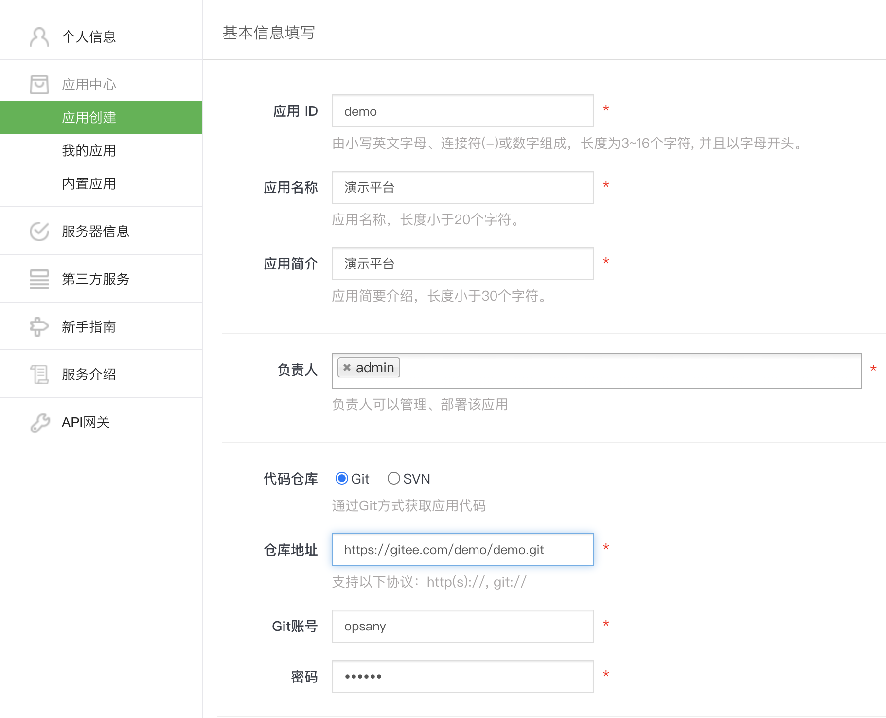
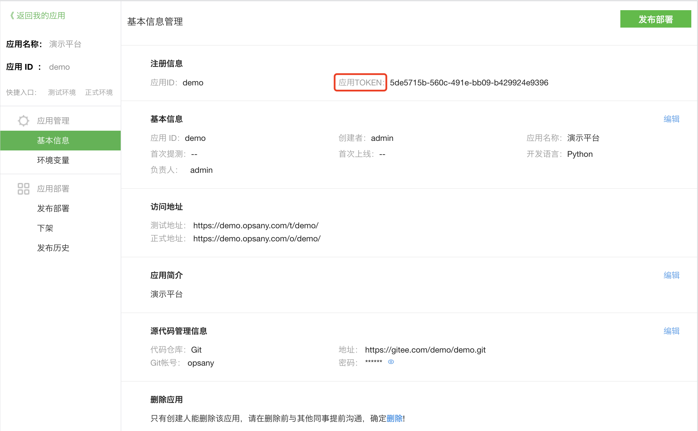

# OpsAny后端开发框架使用手册

## 本地开发环境

0. 开始前准备工作

- 已经部署OpsAny社区版，并且可以正常使用。
- 开发主机安装Python3、MySQL、Git工具。
- 准备一个有验证功能的Git仓库，用于提交开发的代码。

1. 开发中心创建应用

访问OpsAny，在导航菜单中打开【开发中心】-(应用创建)



创建完成后，会自动生成“应用TOKEN”，需要记录下来，下面会配置在代码的配置文件中。



2. 获取后端开发框架代码

```
git clone https://gitee.com/unixhot/opsany-backend-framework.git
```

3. 本地Python虚拟环境搭建

```
# Step 1. 本地安装Python 3.6.x版本
（步骤略）

# Step 2. 创建Python虚拟环境
python3 -m venv opsany-demo-env

# Step 3. 进入Python虚拟环境(Linux)
source opsany-demo-env/bin/activate

# Step 4. 安装后端开发框架依赖包
cd backend-framework
pip3 install -r requirements.txt
```

4. 创建MySQL数据库

在你本地的开发环境，或者企业内部开发环境部署MySQL，默认使用MySQL作为数据存储（必选）。

```
# Step 1: 创建demo数据库并授权
create database demo DEFAULT CHARACTER SET utf8 COLLATE utf8_general_ci;
grant all on demo.* to demo@'%' identified by "OpsAny@2020";

# Step 2: 授权让OpsAny平台可以自动进行数据库管理操作
grant all on demo.* to opsany@'%';

# Step 3: 刷新授权
FLUSH PRIVILEGES;
```

5. 修改配置文件

- 修改config/__init__.py配置

```
# BK_URL：  请修改为平台地址，例：https://demo.opsany.com
# APP_CODE: 应用唯一标识，例：demo
# SECRET_KEY: 应用TOKEN(在创建的应用详情页可以看到)
```
- 修改config/dev.py配置

```
# 1. 增加BK_TOKEN，与线上login组件打通，进行身份认证
BK_TOKEN: 线上bk_token(从线上接口请求头cookie中获取)

# 2. 修改数据库信息
DATABASES.NAME: 数据库名称(与应用平台唯一标识一致)
DATABASES.USER： 数据库用户名(建议与数据库名称一致)
DATABASES.PASSWORD：数据库密码
DATABASES.HOST：数据库地址（可以是本地也可以是线上，与第三步创建数据库一致）
DATABASES.PORT：数据库端口
3. 初始化
python manage.py makemigrations
python manage.py migrate
```

6. 统一权限新建平台菜单并授权

打开【统一权限】-（菜单管理）-（新建平台）


前后端开发人员在菜单的定义上需要保持一致。平台的菜单是由动态从后端服务提供的，并经过统一权限的权限过滤。

- 菜单分为三级：平台-目录-菜单，可依次创建，排序规则为 1 1.1 1.1.1

1. 新建平台
菜单名称：标准开发框架
请替换为平台的APPID

地址：/t/APPID
菜单标识：APPID
排序：101("排序可以偏大防止与内置平台重复")

2. 新建概览页(在新建的平台数据上点击新建，上级菜单显示为 标准开发框架)
菜单名称：概览
地址：/
菜单标识：home
排序：101.1

3. 新建一级菜单 (在新建的平台数据上点击新建，上级菜单显示为 标准开发框架)
菜单名称：目录名称
地址：/group
菜单标识：RouteView，当一级菜单下有二级菜单的情况下。菜单标识必须以RouteView开头，该菜单会作为分组使用，无法点击。
排序：101.2

4. 新建二级菜单(在新建的目录数据上点击新建，上级菜单显示为 目录1)
菜单名称：菜单名称
地址：/group/option1     # 地址路径必须包含一级菜单地址
菜单标识：option1
排序：101.2.1

6. 将当前新建平台添加到当前用户授权的权限策略内

打开【统一权限】-(权限策略)-(超级管理员)-(新增平台权限)-选择刚才增加的平台
点击（编辑）-将新增的菜单全部选中并保存。

7. 本地运行服务。
```
python manage.py runserver 127.0.0.1:8888
```

8. 访问本地开发框架
```
http://127.0.0.1:8888
```

##部署到测试环境

1. 通过OpsAny导航菜单打开【开发中心】-（我的应用）-点击对应应用。并验证填写的Git地址是否正确。

2. 在测试环境创建MySQL数据库

```
# Step 1: 创建demo数据库并授权
create database example DEFAULT CHARACTER SET utf8 COLLATE utf8_general_ci;
grant all on example.* to example@'%' identified by "OpsAny@2020";

# Step 2: 授权让OpsAny平台可以自动进行数据库管理操作
grant all on example.* to opsany@'%';

# Step 3: 刷新授权
FLUSH PRIVILEGES;
```


3. 修改测试环境配置文件

- 修改config/stag.py配置
```
DATABASES.NAME: 数据库名称(与应用平台唯一标识一致)
DATABASES.USER： 数据库用户名(建议与数据库名称一致)
DATABASES.PASSWORD：数据库密码
DATABASES.HOST：数据库地址（可以是本地也可以是线上，与第三步创建数据库一致）
DATABASES.PORT：数据库端口
```

5. 提交代码到git
```
git add .
git commit -m"feat: 初始化项目"
git push
```

6. 测试环境部署

- 【开发中心】-（我的应用）-点击部署新建的应用
- 部署成功后测试环境点击马上访问
